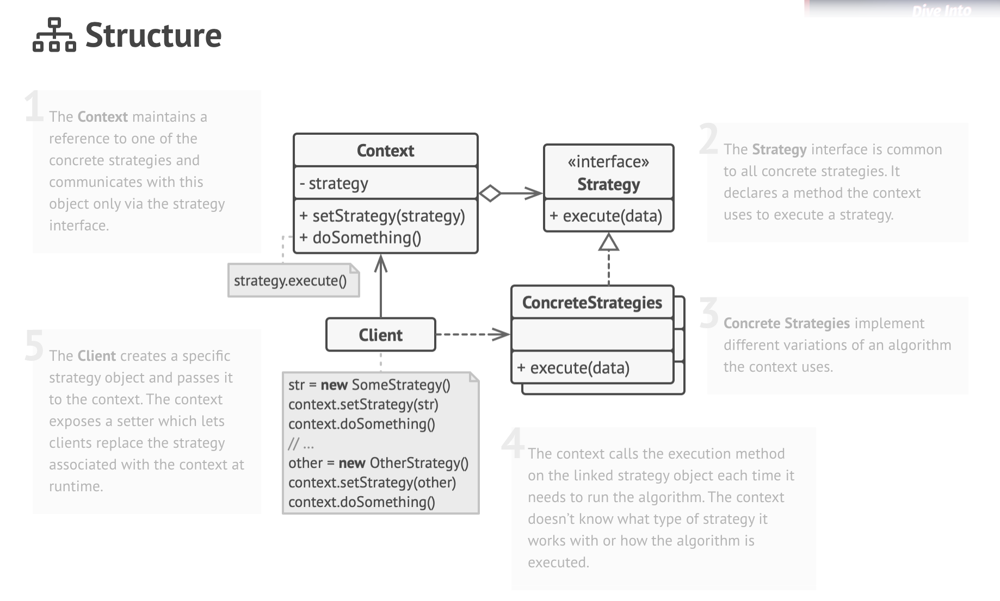

# Design Patterns

## Strategy Pattern

Strategy is a behavioral design pattern that lets you define a family of algorithms,
put each of them into a separate class, and make their objects interchangeable.

The Strategy pattern suggests that you take a class that does something specific 
in a lot of different ways and extract all of these algorithms into separate classes 
called  *strategies*.

The original class, called  *context*, must have a field for storing a reference to 
one of the strategies. The context delegates the work to a linked strategy object instead 
of executing it on its own.

The context isn’t responsible for selecting an appropriate algorithm for the job. 
Instead, the client passes the desired strategy to the context. 
In fact, the context doesn’t know much about strategies. 
It works with all strategies through the same generic interface, which only exposes a 
single method for triggering the algorithm encapsulated within the selected strategy.

This way the context becomes independent of concrete strategies, so you can add new 
algorithms or modify existing ones without changing the code of the context or other 
strategies.

### **How to Implement**

1. In the context class, identify an algorithm that’s prone to frequent changes. 
It may also be a massive conditional that selects and executes a variant of the same algorithm at runtime.
2. Declare the strategy interface common to all variants of the algorithm.
3. One by one, extract all algorithms into their own classes. They should all implement the strategy interface.
4. In the context class, add a field for storing a reference to a strategy object. Provide a setter for replacing 
values of that field. The context should work with the strategy object only via the strategy interface. 
The context may define an interface which lets the strategy access its data.
5. Clients of the context must associate it with a suitable strategy that matches the way they expect the 
context to perform its primary job.
